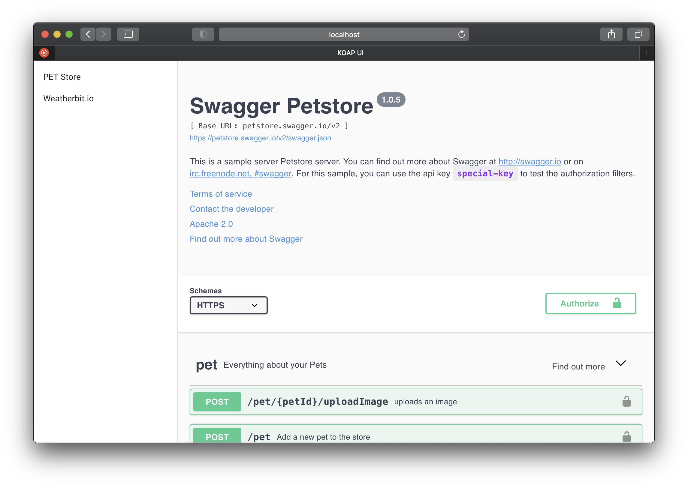

## OpenAPI Dev Portal (Kubernetes)

- [Manifest](./manifest.md)
- [Kuberntes Integration](./k8s.md)

### Examples

- [Manifest](https://github.com/chaliy/koap/tree/main/examples/manifest.yaml)
- [Manifesst Kubernetes ConfigMaps](https://github.com/chaliy/koap/tree/main/examples/configmaps/)

### UI

